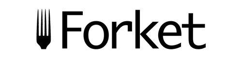

  

A tool that splits your code into client and server so you have [RSC (React Server Components)](https://react.dev/reference/rsc/server-components) working.
‎
## Examples

* [esbuild](./examples/esbuild/)
* [Vite](./examples/vite/)

## Materials/inspiration

* By Lazar Nikolov https://www.smashingmagazine.com/2024/05/forensics-react-server-components
* By Dan Abramov - https://github.com/reactwg/server-components/discussions/5
* https://edspencer.net/2024/7/1/decoding-react-server-component-payloads
* Back in 2020 - https://www.youtube.com/watch?v=TQQPAU21ZUw
* Dev tool to see RSC - https://www.alvar.dev/blog/creating-devtools-for-react-server-components
* RSC from scratch - https://www.youtube.com/watch?v=MaebEqhZR84