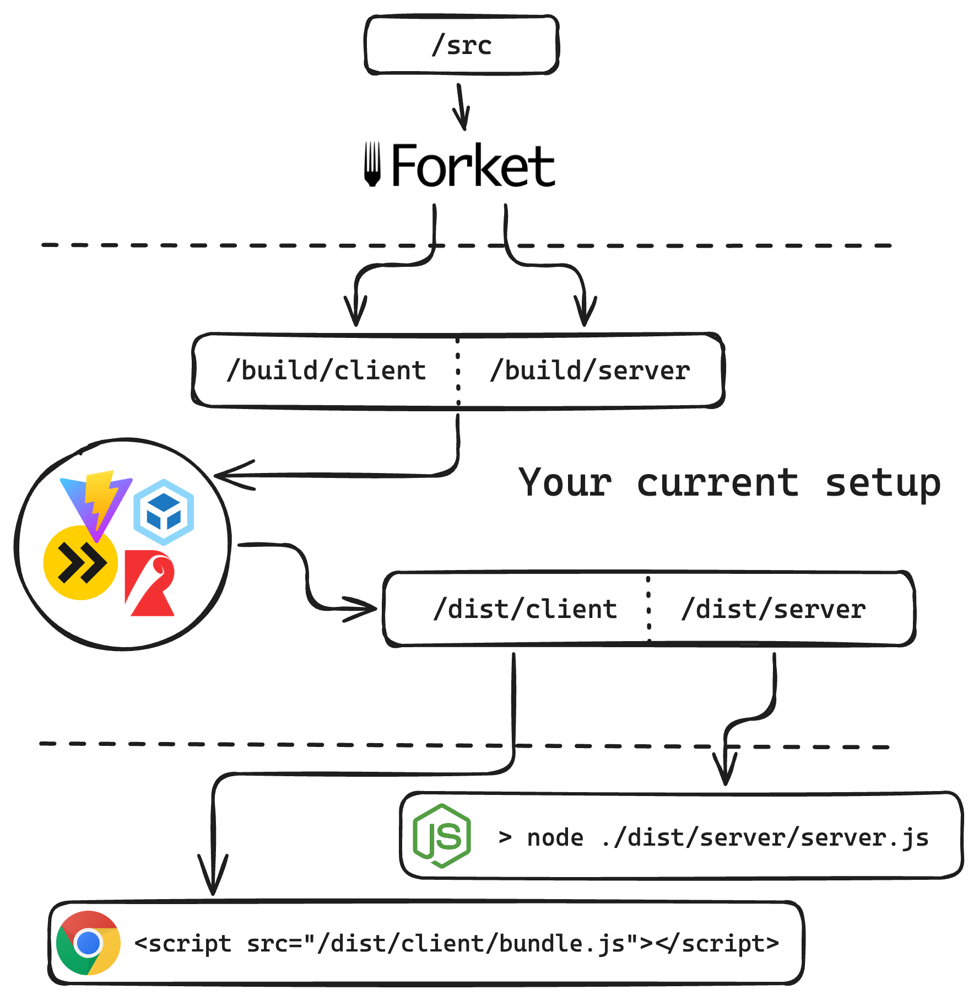

<h1 align="center">Forket - the RSC support without a framework</h1>

Forket is a tool that splits your code to client and server so you have [RSC (React Server Components)](https://react.dev/reference/rsc/server-components) working without a framework.

* [Documentation](./forket/README.md)
* [Examples/templates](#examplestemplates)

---

  

## RSC features

| Feature | Is supported |
| ----------- | ----------- |
| Streaming | ✅ |
| Async server components | ✅ |
| Mixing server and client components | ✅ |
| `"use client"` and `"use server"` directives | ✅ |
| `Suspense` + `use` | ✅ |
| Server functions | ✅ |
| Server actions | ✅ |
| `useActionState`, `useTransition` | ✅ |
| Passing live-promise from server to client | ✅ |
‎
## Examples/Templates

* esbuild / [Basic code snippets](./examples/basic/) - app that covers the examples from the [official server components](https://react.dev/reference/rsc/server-components) docs.
* esbuild / [Image annotator](./examples/annotation-app/) - a little bit more complicated app for annotating pictures
* Vite / [Inspirational quote generator](./examples/vite/) - generates inspirational quote
* Webpack / [Inspirational quote generator](./examples/webpack/) - generates inspirational quote

## Materials/inspiration

* By Lazar Nikolov https://www.smashingmagazine.com/2024/05/forensics-react-server-components
* By Dan Abramov - https://github.com/reactwg/server-components/discussions/5
* https://edspencer.net/2024/7/1/decoding-react-server-component-payloads
* Back in 2020 - https://www.youtube.com/watch?v=TQQPAU21ZUw
* Dev tool to see RSC - https://www.alvar.dev/blog/creating-devtools-for-react-server-components
* RSC from scratch - https://www.youtube.com/watch?v=MaebEqhZR84