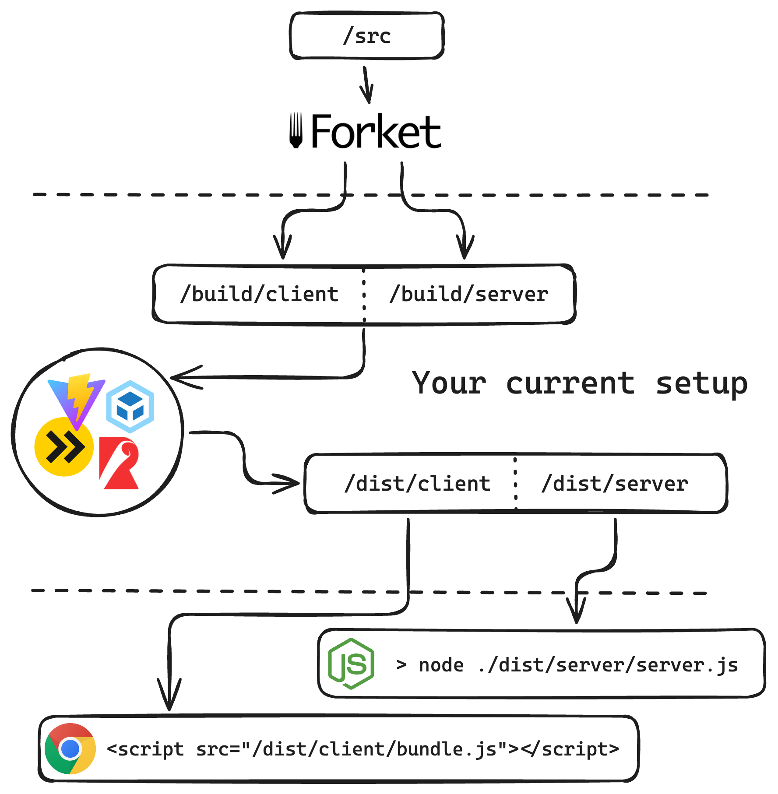

# 𐂐 forket

## Mental model

The idea of this library is to work before your usual pipeline kicks in. Forket does static analyses of your code and produces client and server versions. After that you have to hook your current building tools to process the files - compile/transpile, create client bundles and running HTTP server. There is a small example [here](https://github.com/krasimir/forket/tree/main/examples/just-cli/) that demonstrates that split (check out the [src](https://github.com/krasimir/forket/tree/main/examples/just-cli/src/) directory and result [build](https://github.com/krasimir/forket/tree/main/examples/just-cli/build/)).

<p align="center">
  
</p>

## Installation

```
> npm install forket
```

## Usage

Forket will be part of your app when you are building it and when you are running it. That's because first we need to split and annotate the code and later we need someone to understand those annotations.

### At build time

You either use the CLI version or incorporate the library in your scripts. For example

```
> npx forket
```

will run Forket and as soon as you have `forket.config.js` nearby you'll get the splitting working. Check [this example](https://github.com/krasimir/forket/tree/main/examples//just-cli/). Install the dependencies and run the command there to replicate.

Or if you have some sort of build scripting (recommended):

```js
import Forket from 'forket';

const forket = await Forket();
await forket.process();
```

This is the first part of the job. After that your code is split into `server` and `client` version. Check the [configuration](#configuration) section to see what's in `forket.config.js`.

### At run time

There is a bit of a glue code that is needed to make both server and client work together.

#### Instrument your HTTP server

Let's say that you have some sort of HTTP server library like [express](https://expressjs.com/):

```js
import express from "express";
import Forket from "forket";

const port = 8087;
const app = express();
const server = http.createServer(app);

Forket().then((forket) => {
  app.use("/@forket", forket.forketServerActions());
  app.get("/", forket.serveApp({
    factory: (req) => <App request={req} />
  }));
});

server.listen(port, () => {
  console.log(`App listening on port ${port}.`);
});
```

We are defining an endpoint for our [server functions](https://react.dev/reference/rsc/server-functions) and making sure that Forket is serving our main page component. Internally the library is using [renderToPipeableStream](https://react.dev/reference/react-dom/server/renderToPipeableStream) to stream the React components. Notice that the path `/@forket` is configurable if you want to have something different.

#### At least one client entry point

Forket requires a client entry point. It is placing some utilities in the global scope. That's why you need at least one file in your root directory that has `"use client"`. Usually that's the file that you pass to your bundler.

```js
"use client"
```

## Configuration

There are two ways to pass configuration to Forket - via `forket.config.js` file in your root directory or as an object to `Forket()` call. The recommended option is to use `forket.config.js` and only overwrite something (like the `watch` flag) via the second option. Here's an example of `forket.config.js` with its defaults:

```js
// forket.config.js
import path from "path";
import { fileURLToPath } from "url";

const __filename = fileURLToPath(import.meta.url);
const __dirname = path.dirname(__filename);

const config = {
  sourceDir: path.normalize(path.join(__dirname, "src")),
  buildDir: path.normalize(path.join(__dirname, "build")),
  serverDirName: "server",
  clientDirName: "client",
  serverActionsEndpoint: "/@forket",
  clientCopyableFiles: [".css", ".scss",
    ".sass", ".less", ".styl", ".png", ".jpg", ".jpeg", ".gif", ".svg", ".webp", ".ico", ".avif", ".woff", ".woff2", ".ttf", ".otf", ".eot", ".mp3", ".wav", ".ogg", ".mp4", ".webm", ".m4a", ".pdf", ".zip", ".gz", ".tar", ".bz2", ".7z", ".wasm"
  ],
  watch: false,
  printGraph: false,
  enableLogging: true
}

export default config;
```

In most of the cases you'll use `sourceDir`, `buildDir` and `watch`. Here's a table exaplaining each of fields:

| Field | Required | Description | Default value |
| ----------- | ----------- | ----------- | ----------- |
| sourceDir | required | The location of your app's source code | None. You have to pass that. |
| buildDir | required | The location where Forket will create the _server_ and _client_ version of your code | None. You have to pass that. |
| serverDirName | optional | The name of the folder for the server version of your code. | `"server"` |
| clientDirName | optional | The name of the folder for the client version of your code. | `"client"` |
| serverActionsEndpoint | optional | The path at your HTTP server that will handle the server actions requests. | `"/@forket"` |
| clientCopyableFiles | optional | While Forket is splitting your source code there are type of files that simply need to be copied over. | Some long list of file extensions. |
| watch | optional | Someone needs to watch your source folder for changes and run the splitting over and over again. If you set this to `true` you'll get that. You usually want this on when you are developing locally. | `false` |
| printGraph | optional | Forket renderes a nice graph showing your components and their dependencies. | `false` |
| enableLogging | optional | If you want to silent Forket in the terminal and in the browser set this to `false` | `true` |

## Where to start

To get an idea of how it works jump to some of the [examples](https://github.com/krasimir/forket/tree/main/examples/). For example the [basic](https://github.com/krasimir/forket/tree/main/examples/basic/) one. Install the dependencies via `npm install` and run `npm run dev`. Then open http://localhost:8087. Notice how the build pipeline is done in the [`dev.js`](https://github.com/krasimir/forket/tree/main/examples/basic/scripts/dev.js) file and how the [`server.js`](https://github.com/krasimir/forket/tree/main/examples/basic/src/server.tsx) looks like.

You probably currently rely on something like [Vite](https://github.com/krasimir/forket/tree/main/examples/vite) or [Webpack](https://github.com/krasimir/forket/tree/main/examples/webpack/). There are examples of those too. The main idea is to make Forket work before your current building steps. Trying to inject it into what you have at the moment will be a challenge.

## Running tests

```
> npm install
> npm run test
> npm run test --spec=01 --case=f
```